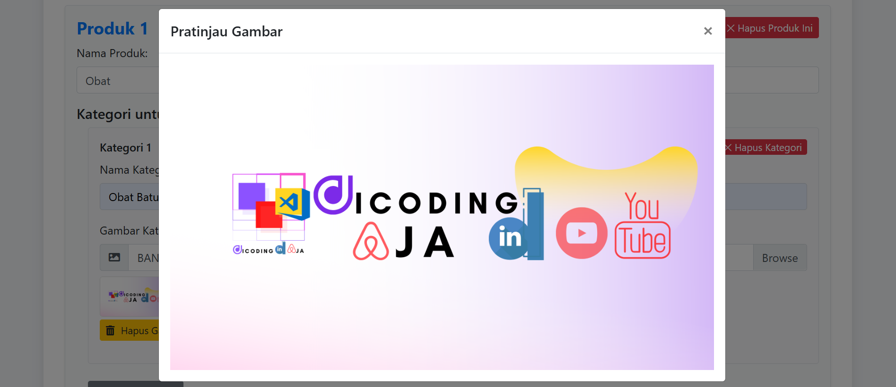
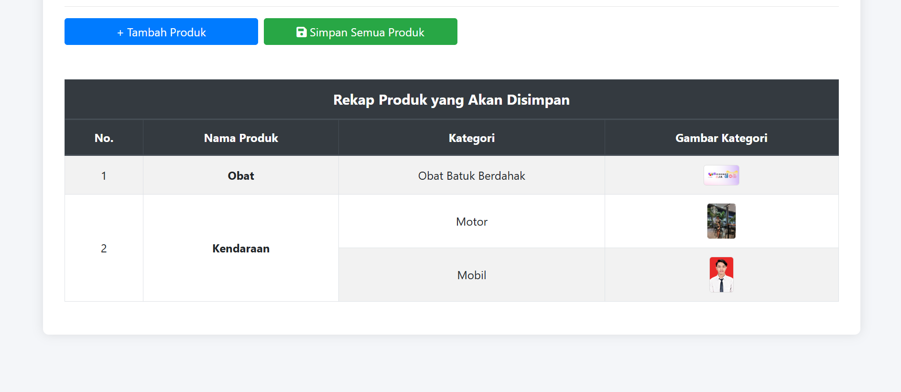

# 🛒 GreenMart - Dynamic Product Input Web App

GreenMart adalah aplikasi web yang memungkinkan pengguna untuk menambahkan produk dinamis secara fleksibel, termasuk nama produk, deskripsi kategori, serta unggahan gambar.

## ✨ Fitur Utama

-   Tambah hingga 5 produk
-   Setiap produk dapat memiliki hingga 3 kategori
-   Upload gambar untuk setiap kategori (hanya JPG, JPEG, PNG)
-   Ikon aksi: tambah ➕, hapus ❌, unggah ⬆️, dan hapus gambar 🗑️

## ✨ Fitur Tambahan

-   Gambar yang diunggah dapat diklik untuk dilihat secara penuh
-   Tabel dinamis dengan penomoran otomatis rekap data yang terintegrasi
-   Serta sistem informasi POP UP validasi
-   Fitur tambahan lainnya seperti reset dan simpan data

## 🚀 Cara Menjalankan

1. Clone repo ini atau unduh sebagai ZIP.
2. Buka `index.html` langsung di browser.

Tidak butuh setup server atau database, aplikasi ini berjalan sepenuhnya di sisi client.

## 🧪 Validasi Gambar

-   Format gambar diperbolehkan: `.jpg`, `.jpeg`, `.png`
-   Ukuran file maksimum dapat ditentukan di dalam logika JavaScript saat ini 2MB (Max)

## 🧑‍💻 Teknologi

-   Laravel
-   Blade
-   HTML5
-   CSS3 (dengan styling responsif)
-   JavaScript (Vanilla)

## 📸 Demo

## 📃 Owner

DB : admin_greenmart

by Rony Irfannandhy
